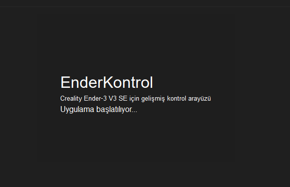
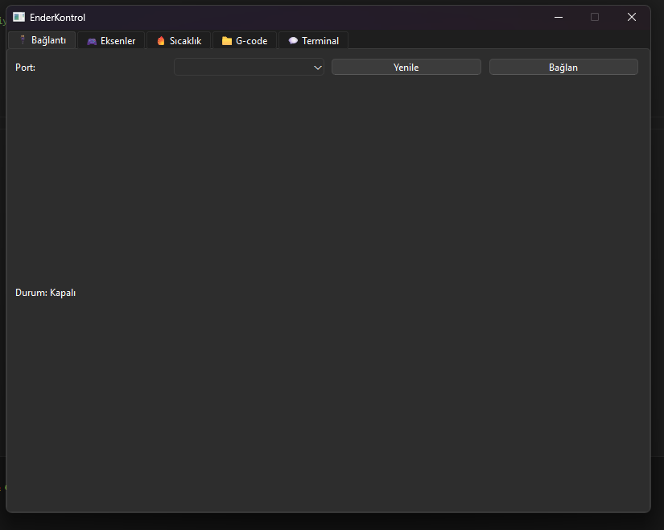
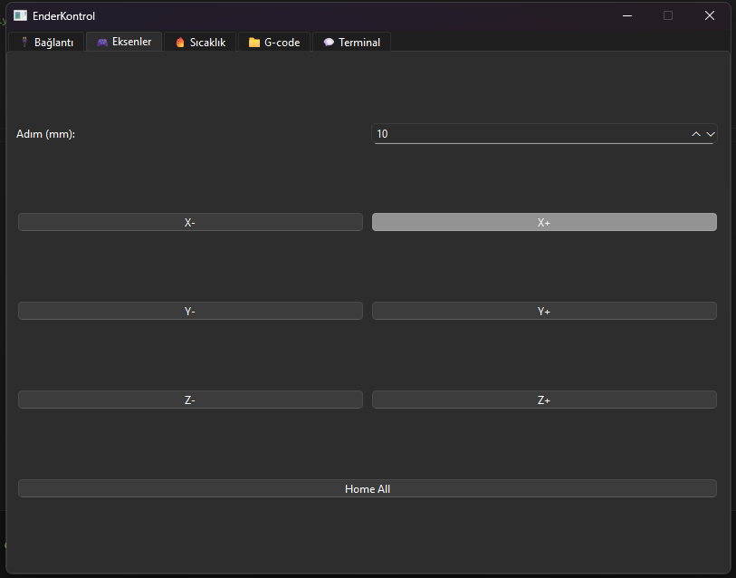
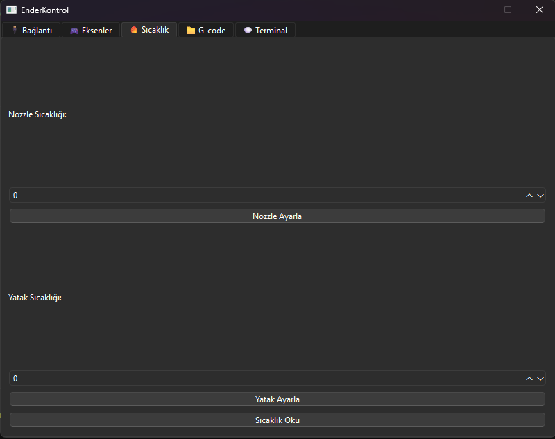
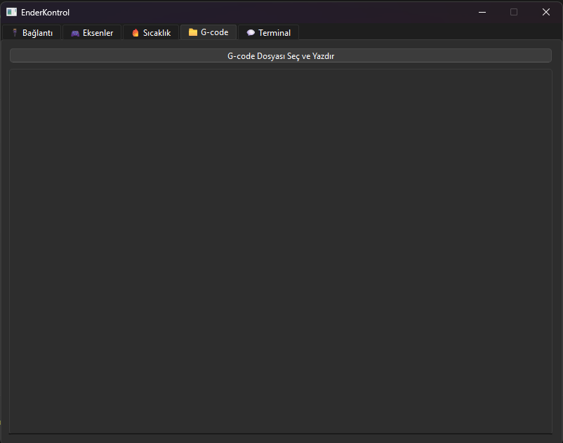

# EnderKontrol

**EnderKontrol**, Creality Ender-3 V3 SE ve diğer Marlin tabanlı 3D yazıcılar için geliştirilmiş bir Python + PyQt6 masaüstü kontrol uygulamasıdır.

## 🚀 Özellikler
- 🔌 Seri port üzerinden yazıcıya bağlanma
- 🎮 X/Y/Z eksenlerini hareket ettirme
- 🏠 Home All ve Home X/Y/Z desteği
- 🔥 Nozzle ve Yatak sıcaklığı ayarlama
- 🌡 Anlık sıcaklık bilgilerini okuma
- 📁 `.gcode` dosyası seçip yazdırma
- 💬 Terminal sekmesi (canlı yanıt ve manuel komut girişi)
- 🎨 Modern Türkçe arayüz, splash ekran ve özel ikon

---

# Uygulama Ekran Görüntüleri

### 1-

  

### 2-

  

### 3-

  

### 4-

  

### 5-

  

### 6-

  

